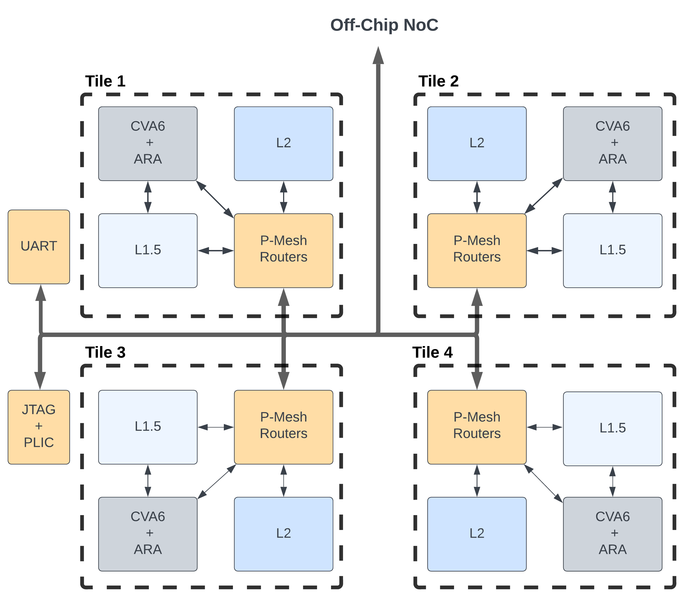

## CORE-V Polara APU

CORE-V Polara APU originated from [Ara](https://github.com/pulp-platform/ara)[1] and [Openpiton](https://github.com/PrincetonUniversity/openpiton)[2] projects. CORE-V Polara APU, AKA Polara, has 4 RISC-V vector cores (Ara) connected together using OpenPiton platform. Figure below shows the top-level diagram of Polara. 

<!-- . -->
<p align="center">

</p>


Polara is also equipped with low precision computation for DNN inferece. Please refer to [3] for more details. In case you would be interested to join the project please feel free to open an issue, or involve yourself in any open issues/discussions. Contributions are always welcome! First time contributors should review the Contributing guide [TODO].

## Building

Polara project is hosted at OpenHW github repository. You first need to clone the repository as described below:

    cd [YOUR_PROJECT_DIR]
    git clone https://github.com/openhwgroup/core-v-polara-apu.git
    git submodule update --init --recursive
    cd core-v-polara-apu

### Pre-requisites

1. RISC-V LLVM compiler with vector extension support: Polara, you will need to install RISC-V compiler with vector extension support. We recommend to follow the [steps](https://github.com/pulp-platform/ara#toolchain) provided by Ara project. Polara assumes that the LLVM RISC-V compiler with vector extension is availble at `${DV_ROOT}/design/chip/tile/ara/install/riscv-llvm/bin/clang`. Following [steps](https://github.com/pulp-platform/ara#toolchain) in ara submodule of Polara should be enough to prepare the compiler properly. 

2. Acess to simulators: For simulation, Polara has been tested with VCS and Modelsim/Questasim. You will need to have access to one of these simulators. 

3. RISC-V GCC compiler (for openpiton).


#### Environment Setup
- The ```PITON_ROOT``` environment variable should point to the root of the OpenPiton repository
- The Synopsys environment for simulation should be setup separately by the user.  Besides adding correct paths to your ```PATH``` and ```LD_LIBRARY_PATH``` (usually accomplished by a script provided by Synopsys), the OpenPiton tools specifically reference the ```VCS_HOME``` environment variable which should   point to the root of the Synopsys VCS installation.

- Put this in your `.bashrc`:

    alias phere='PITON_ROOT="$PWD" source piton/piton_settings.bashrc ARIANE_ROOT="$PITON_ROOT/piton/design/chip/tile/ariane"'

    - A CShell version of `piton_settings.bashrc` is provided, but OpenPiton has not been tested for and currently does not support CShell

- Top level directory structure:
    - piton/
        - All OpenPiton design and verification files
    - docs/
        - OpenPiton documentation
    - build/
        - Working directory for simulation and simulation models


##### Notes on Environment and Dependencies

- Depending on your system setup, Synopsys tools may require the ```-full64``` flag.  This can easily be accomplished by adding a bash function as shown in the following example for VCS (also required for URG):

    ```bash
    function vcs() { command vcs -full64 "$@"; }; export -f vcs
    ```

- On many systems, an error with `goldfinger`, or other errors not described below, may indicate that you should run the `mktools` command once to rebuild a number of the tools before continuing. If you see issues later with building or running simulations, try running `mktools` if you have not already.
- In some cases, you may need to recompile the PLI libraries we provide. This is done using `mkplilib` with the argument for the simulator you want to rebuild for. You may need to run `mkplilib clean` first, then depending on which simulator, you can build with: `mkplilib vcs`, `mkplilib ncverilog`, `mkplilib icarus`, or `mkplilib modelsim`.
- If you see an error with `bw_cpp` then you may need to install gcc/g++ (to get `cpp`), or `csh` (`csh` on ubuntu, `tcsh` on centos)
- If you see an error with `goldfinger` or `g_as` then you may need to install 32-bit glibc (`libc6-i386` on ubuntu, `glibc.i686` on centos)
- If you see an error with `goldfinger` or `m4` then you may need to install libelf (`libelf-dev` on ubuntu, `elfutils-libelf-devel` on centos)
- You also need the Perl Bit::Vector package installed on your machine (`libbit-vector-perl` on ubuntu, `perl-Bit-Vector.x86_64` on centos, also installable via CPAN)


Assuming you have access to tools listed in pre-requisites, you can build a 2x2 tile simulation model using the following steps ( first re-load the terminal or create a new tab):

    cd [PITON_TOP_FOLDER]
    phere
    cd build
    sims -sys=manycore -x_tiles=2 -y_tiles=2 -vcs_build -ariane -config_rtl=SYNTHESIS -vcs_build_args="-assert svaext +define+VLEN=4096 +define+NR_LANES=4 +define+ARIANE_ACCELERATOR_PORT=1" -vcs_build_args="-LDFLAGS -Wl,--no-as-needed"

This last step, builds the HW for simulation. To run `hello world` on all cores, run the following:

    sims -sys=manycore -vcs_run -x_tiles=2 -y_tiles=2 hello_world_many.c -ariane -rtl_timeout=500000

To run RISC-V Vector regression tests (Testing single core single tile):
    
    sims -group='ara_tile1'

For multi core regression test (default configuration 2x2 tiles):

    sims -group="ara_tile2x2"

To run in GUI mode:

    sims -sys=manycore -x_tiles=1 -y_tiles=1 -vcs_build -ariane -config_rtl=SYNTHESIS -vcs_build_args="-assert svaext +define+VLEN=4096 +define+NR_LANES=4 +define+ARIANE_ACCELERATOR_PORT=1" -vcs_build_args="-LDFLAGS -Wl,--no-as-needed -kdb" -debug_all

    sims  -sys=manycore -x_tiles=1 -y_tiles=1 -vcs_run -ariane hello_world_many.c -gui


# Support for the Ariane RV64IMAC Core

This version of OpenPiton supports the [64bit Ariane RISC-V processor](https://github.com/pulp-platform/ariane) from ETH Zurich.
To this end, Ariane has been equipped with a different L1 cache subsystem that follows a write-through protocol and that has support for cache invalidations and atomics.
This L1 cache system is designed to connect directly to the L1.5 cache provided by OpenPiton's P-Mesh.

Check out the sections below to see how to run the RISC-V tests or simple bare-metal C programs in simulation.


#### Environment Setup

In addition to the OpenPiton setup described above, you have to adapt the paths in the `ariane_setup.sh` script to match with your installation (we support Questasim, VCS and Verilator at the moment). Source this script from the OpenPiton root folder and build the RISC-V tools with `ariane_build_tools.sh` if you are running this for the first time:
1. ```cd $PITON_ROOT/```
2. ```source piton/ariane_setup.sh```
3. ```piton/ariane_build_tools.sh```

Step 3. will then download and compile the RISC-V toolchain, the assembly tests and Verilator.

> Note that the address map is different from the standard OpenPiton configuration. DRAM is mapped to `0x8000_0000`, hence the assembly tests and C programs are linked with this offset. Have a look at `piton/design/xilinx/genesys2/devices_ariane.xml` for a complete address mapping overview.

> Also note that we use a slightly adapted version of `syscalls.c`. Instead of using the RISC-V FESVR, we use the OpenPiton testbench monitors to observe whether a test has passed or not. Hence we added the corresponding pass/fail traps to the exit function in `syscalls.c`.

> For simulation Questasim 10.6b, VCS 2017.03 or Verilator 4.014 is needed
 (older versions may work, but are untested).

> You will need Vivado 2018.2 or newer to build an FPGA bitstream with Ariane.


#### Running RISC-V Tests and Benchmarks

The RISC-V benchmarks are precompiled in the tool setup step mentioned above. You can run individual benchmarks by first building the simulation model with

1. ```cd $PITON_ROOT/build```
2. ```sims -sys=manycore -x_tiles=1 -y_tiles=1 -msm_build -ariane```

Then, invoke a specific riscv test with the `-precompiled` switch as follows

```sims -sys=manycore -msm_run -x_tiles=1 -y_tiles=1 rv64ui-p-addi.S -ariane -precompiled```

This will look for the precompiled ISA test binary named `rv64ui-p-addi` in the RISC-V tests folder `$ARIANE_ROOT/tmp/riscv-tests/build/isa` and run it.

In order to run a RISC-V benchmark, do

```sims -sys=manycore -msm_run -x_tiles=1 -y_tiles=1 dhrystone.riscv -ariane -precompiled```

The printf output will be directed to `fake_uart.log` in this case (in the build folder).

> Note: if you see the `Warning: [l15_adapter] return type 004 is not (yet) supported by l15 adapter.` warning in the simulation output, do not worry. This is only generated since Ariane does currently not support OpenPiton's packet-based interrupt packets arriving over the memory interface.


#### Running Custom Programs

You can also run test programs written in C. The following example program just prints 32 times "hello_world" to the fake UART (see `fake_uart.log` file).

1. ```cd $PITON_ROOT/build```
2. ```sims -sys=manycore -x_tiles=1 -y_tiles=1 -msm_build -ariane```
3. ```sims -sys=manycore -msm_run -x_tiles=1 -y_tiles=1 hello_world.c -ariane -rtl_timeout 10000000```

And a simple hello world program running on multiple tiles can run as follows:

1. ```cd $PITON_ROOT/build```
2. ```sims -sys=manycore -x_tiles=4 -y_tiles=4 -msm_build -ariane```
3. ```sims -sys=manycore -msm_run -x_tiles=4 -y_tiles=4  hello_world_many.c -ariane -finish_mask 0x1111111111111111 -rtl_timeout 1000000```

In the example above, we have a 4x4 Ariane tile configuration, where each core just prints its own hart ID (hardware thread ID) to the fake UART. Synchronization among the harts is achieved using an atomic ADD operation.

> Note that we have to adjust the finish mask in this case, since we expect all 16 cores to hit the pass/fail trap.


#### Regressions

The RISC-V ISA tests, benchmarks and some additonal simple example programs have been added to the regression suite of OpenPiton, and can be invoked as described below.

- RISC-V ISA tests are grouped into the following four batches, where the last two are the regressions for atomic memory operations (AMOs):

```sims -group=ariane_tile1_asm_tests_p -sim_type=msm```

```sims -group=ariane_tile1_asm_tests_v -sim_type=msm```

```sims -group=ariane_tile1_amo_tests_p -sim_type=msm```

```sims -group=ariane_tile1_amo_tests_v -sim_type=msm```

- RISC-V benchmarks can be run with:

```sims -group=ariane_tile1_benchmarks -sim_type=msm```

- Simple hello world programs and AMO tests for 1 tile can be invoked with

```sims -group=ariane_tile1_simple -sim_type=msm```

- And a multicore "hello world" example running on 16 tiles can be run with

```sims -group=ariane_tile16_simple -sim_type=msm```


If you would like to get an overview of the exit status of a regression batch, step into the regression subfolder and call `regreport . -summary`.

#### Find out more

- More information about OpenPiton is available at www.openpiton.org
- [Follow us on Twitter!](https://www.twitter.com/openpiton)
- Get help from others by joining our [Google Group](https://groups.google.com/group/openpiton)
- Keep up-to-date with the latest releases at the [OpenPiton Blog](https://openpiton-blog.princeton.edu)

If you use OpenPiton in your research please reference our ASPLOS 2016 paper mentioned above and send us a citation of your work.


## References
1. [Cavalcante, Matheus, et al. Ara: A 1-GHz+ Scalable and Energy-Efficient RISC-V Vector Processor With Multiprecision Floating-Point Support in 22-nm FD-SOI. IEEE Transactions on Very Large Scale Integration (VLSI) Systems 2020.](https://ieeexplore.ieee.org/document/8918510)
2. [Balkind, Jonathan, et al. OpenPiton: An Open Source Manycore Research Framework. In Proceedings of the Twenty-First International Conference on Architectural Support for Programming Languages and Operating Systems (ASPLOS '16).](https://dl.acm.org/doi/abs/10.1145/2954679.2872414)
3. [Askari Hemmat, MohammadHossein, et al. Quark: An Integer RISC-V Vector Processor for Sub-Byte Quantized DNN Inference. 2023 International Symposium on Circuits and Systems (ISCAS 2023).](https://arxiv.org/pdf/2302.05996.pdf)
